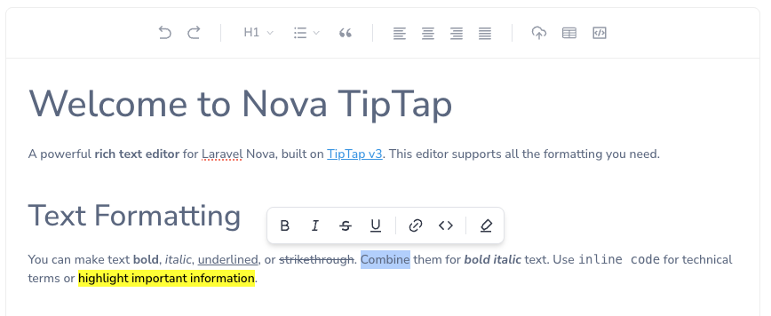

[](https://github.com/marshmallow-packages/nova-tiptap)
[](https://github.com/marshmallow-packages/nova-tiptap)
[](https://github.com/marshmallow-packages/nova-tiptap)

# Laravel Nova Tiptap Editor Field

A powerful rich text editor for Laravel Nova built on [TipTap v3](https://tiptap.dev).



> [!Warning]
> When updating from `manogi/nova-tiptap`, replace all instances of `Manogi\Tiptap\Tiptap` with `Marshmallow\Tiptap\Tiptap`.

> [!IMPORTANT]
> This is a maintained fork of the [original package](https://github.com/bastihilger/nova-tiptap) with Nova 5 support.

## Installation

```bash
composer require marshmallow/nova-tiptap
```

Add the use statement to your Nova resource:

```php
use Marshmallow\Tiptap\Tiptap;
```

## Basic Usage

```php
Tiptap::make('Content')
```

This provides a simple editor with bold and italic buttons only.

## Button Configuration

Create a fully-featured editor by configuring your desired buttons:

```php
Tiptap::make('Content')
  ->buttons([
    'heading', 'bold', 'italic', '|', 'link', 'bulletList', 'orderedList',
    // Add more buttons as needed
  ])
```

### Available Buttons

| Button             | Description                                                                                     |
| ------------------ | ----------------------------------------------------------------------------------------------- |
| `heading`          | Text headings dropdown (H1, H2, H3, etc.)                                                       |
| `headingDropdown`  | Alias for `heading`                                                                             |
| `listDropdown`     | Bullet and ordered lists in a dropdown                                                          |
| `alignDropdown`    | Text alignment options in a dropdown                                                            |
| `color`            | Color text formatting                                                                           |
| `backgroundColor`  | Background color formatting                                                                     |
| `bold`             | Bold text formatting                                                                            |
| `italic`           | Italic text formatting                                                                          |
| `strike`           | Strikethrough text                                                                              |
| `underline`        | Underline text                                                                                  |
| `bulletList`       | Unordered/bullet list                                                                           |
| `orderedList`      | Ordered/numbered list                                                                           |
| `link`             | Hyperlinks to URLs or files                                                                     |
| `code`             | Inline code formatting                                                                          |
| `codeBlock`        | Block code with optional syntax highlighting                                                    |
| `blockquote`       | Block quotes                                                                                    |
| `image`            | Insert and upload images via modal                                                              |
| `imageUpload`      | Insert a drag & drop upload zone                                                                |
| `table`            | Create and edit tables                                                                          |
| `tableAlternative` | Alternative UI for creating and editing tables. Supports coloring cell's background and border. |
| `textAlign`        | Text alignment options                                                                          |
| `rtl`              | Right-to-left text direction                                                                    |
| `horizontalRule`   | Horizontal divider line                                                                         |
| `hardBreak`        | Hard line break                                                                                 |
| `history`          | Undo/redo functionality                                                                         |
| `editHtml`         | HTML source code editor                                                                         |
| `\|`               | Vertical divider in toolbar (special)                                                           |
| `br`               | Line break in toolbar (special)                                                                 |

## Feature Configuration

### Headings

The `heading` button displays a dropdown with heading levels and paragraph option:

```php
Tiptap::make('Content')
  ->buttons(['heading'])
  ->headingLevels([2, 3, 4]) // Only allow H2, H3, H4 (default: H1-H3)
```

### Lists

Use `listDropdown` for a compact dropdown with bullet and ordered list options:

```php
Tiptap::make('Content')
  ->buttons(['listDropdown'])
```

Or use separate buttons:

```php
Tiptap::make('Content')
  ->buttons(['bulletList', 'orderedList'])
```

### Links

```php
Tiptap::make('Content')
  ->buttons(['link'])
  ->linkSettings([
    'withFileUpload' => false, // Disable file upload option (default: true)
  ])
  ->fileSettings([
    'disk' => 'public', // Storage disk to use (default: 'public')
    'path' => 'links',  // Path within disk (default: root folder)
  ])
```

### Images

```php
Tiptap::make('Content')
  ->buttons(['image'])
  ->imageSettings([
    'disk' => 'public',     // Storage disk to use
    'path' => 'uploads/images', // Path within disk
    'withFileUpload' => true,   // Allow file uploads (default: true)
  ])
```

#### Drag & Drop Upload

Images can be dragged directly into the editor or pasted from the clipboard. They will automatically upload using your `imageSettings` configuration.

#### Image Upload Zone

Use the `imageUpload` button to insert a TipTap-style drop zone in the editor:

```php
Tiptap::make('Content')
  ->buttons(['imageUpload', 'image'])
  ->imageSettings([
    'disk' => 'public',
    'path' => 'uploads/images',
  ])
```

### Bubble Menu

A floating toolbar appears when text is selected. Configure which buttons appear:

```php
Tiptap::make('Content')
  ->bubbleMenuButtons(['bold', 'italic', '|', 'link', 'color'])
```

Available bubble menu buttons: `bold`, `italic`, `strike`, `underline`, `code`, `highlight`, `subscript`, `superscript`, `link`, `color`, `backgroundColor`, `|` (separator)

To disable the bubble menu:

```php
Tiptap::make('Content')
  ->withoutBubbleMenu()
```

### Text Alignment

Use `alignDropdown` for a compact dropdown or `textAlign` for separate buttons:

```php
Tiptap::make('Content')
  ->buttons(['alignDropdown']) // Dropdown with all alignment options
  // or
  ->buttons(['textAlign']) // Separate buttons for each alignment
  ->alignments(['left', 'center', 'right', 'justify']) // Available alignments
  ->defaultAlignment('left') // Default text alignment
```

### Color options

```php
Tiptap::make('Content')
  ->buttons(['color'])
  ->colors(['#f1f1f1']) // Available colors in HEX
```

### Background color options

```php
Tiptap::make('Content')
  ->buttons(['backgroundColor'])
  ->backgroundColors(['#f1f1f1']) // Available background colors in HEX
```

### Table cell background color options

```php
Tiptap::make('Content')
  ->buttons(['tableAlternative'])
  ->tableCellBackgroundColors(['#f1f1f1']) // Available table cell background colors in HEX
```

### Table cell border color options

```php
Tiptap::make('Content')
  ->buttons(['tableAlternative'])
  ->tableCellBorderColors(['#f1f1f1']) // Available table cell border colors in HEX
```

### RTL Support

```php
Tiptap::make('Content')
  ->buttons(['rtl']) // Adds button to toggle RTL mode
```

### Code Options

Two code formatting options are available:

- `code` - Inline code formatting (`<code>text</code>`)
- `codeBlock` - Block code formatting (`<pre><code>text</code></pre>`)

Enable syntax highlighting for code blocks:

```php
Tiptap::make('Content')
  ->buttons(['codeBlock'])
  ->syntaxHighlighting()
```

### HTML Editing

```php
Tiptap::make('Content')
  ->buttons(['editHtml'])
  ->htmlTheme('night') // Theme for HTML code editor (default: 'material')
```

Available themes are listed on [CodeMirror's theme demo page](https://codemirror.net/demo/theme.html).

### JSON Storage

```php
Tiptap::make('Content')
  ->saveAsJson() // Store content as JSON instead of HTML
```

### Empty Content Sanitization

By default, when a TipTap editor is empty, it returns an empty paragraph with styling (e.g., `<p style="text-align: left"></p>`). If you prefer to get an empty string instead (especially useful for translatable fields), you can enable the sanitization feature:

```php
Tiptap::make('Content')
  ->sanitizeEmptyContent() // Return empty string for empty editor content
```

### Image Pruning

When enabled, this feature automatically removes uploaded images from storage when they are deleted from the TipTap content. Only images with `tt-mode="file"` (uploaded files) will be pruned, not external URLs with `tt-mode="url"`.

#### Enable Globally

First, publish the configuration file:

```bash
php artisan vendor:publish --tag=nova-tiptap-config
```

Then enable image pruning in `config/nova-tiptap.php`:

```php
return [
    'prune_images' => true,
    // ... other config options
];
```

#### Enable Per Field

You can also enable image pruning for specific fields:

```php
Tiptap::make('Content')
  ->buttons(['image'])
  ->imageSettings([
    'disk' => 'public',
    'path' => 'uploads/images',
  ])
  ->pruneImages() // Enable image pruning for this field
```

#### How It Works

The system tracks uploaded images by their `tt-mode="file"` attribute. When content is updated:

1. It extracts all uploaded image URLs from the old content
2. It extracts all uploaded image URLs from the new content
3. Images that exist in the old content but not in the new content are deleted from storage
4. External images with `tt-mode="url"` are never deleted

## Read-Only Mode

The Tiptap field supports Nova's native readonly functionality. When in readonly mode, the editor will display the content without allowing edits:

```php
Tiptap::make('Content')
  ->readonly() // Make the field readonly based on your logic
```

You can also conditionally set the readonly state:

```php
Tiptap::make('Content')
  ->readonly(function ($request) {
      return !$request->user()->isAdmin();
  })
```

## Index View Visibility

Like other rich text fields, this field is hidden from index views. You can display it using a [computed field](https://nova.laravel.com/docs/v5/installation#computed-fields).

## License

The MIT License (MIT). Please see [License File](LICENCE) for more information.
